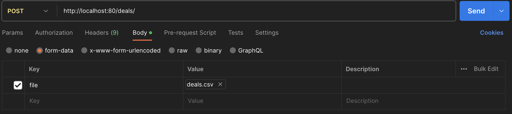

# API для обработки CSV-файлов и получения информации о клиентах

Сервис для сохранения историй сделок из CSV-файлов и получения информации о самых "больших" клиентах


## Инструкция по установке проекта

1. Спулить код с репозитория main.
2. Создать файл entrypoint.sh в директории app.
   1. Вставить в этот файл следующий код:
    ```
    #!/bin/sh

    if [ "$DATABASE" = "postgres" ]
    then
        echo "Waiting for postgres..."
    
        while ! nc -z $SQL_HOST $SQL_PORT; do
          sleep 0.1
        done
    
        echo "PostgreSQL started"
    fi
    
    python manage.py migrate
    python manage.py collectstatic
    
    exec "$@"

    ```
   2. Если операционная система Mac или Linux прописать команду в терминале:
    ```
   chmod +x entrypoint.sh
    ```
3. Запустить сборку контейнеров командой:
```
docker-compose up -d
```
## Инструкция по использованию

1. Для сохранения историй сделок, нужно открыть Postman и отправить POST-запрос по адресу: localhost:80/deals/, 
в теле запроса прикрепив CSV-файл с ключём - 'file'.
   <div></div>
2. Для получения информации о 5 клиентах, потративших наибольшую сумму за весь
период, нужно отправить GET-запрос по адресу: localhost:80/deals/,
3. Администрирование реализовано в админ-панели, ссылка: localhost:80/admin/
4. Документация доступна по ссылкам: localhost:80/swagger/ и localhost:80/redoc/

## Выполненные дополнительные задания
-[x] Команда, используемая для запуска проекта - docker-compose up
-[x] Кэширование данных, возвращаемых GET-эндпоинтом, с обеспечением достоверности ответов
-[x] Сервис django работает на многопоточном WSGI-сервере
-[x] API реализован на основе  DRF
